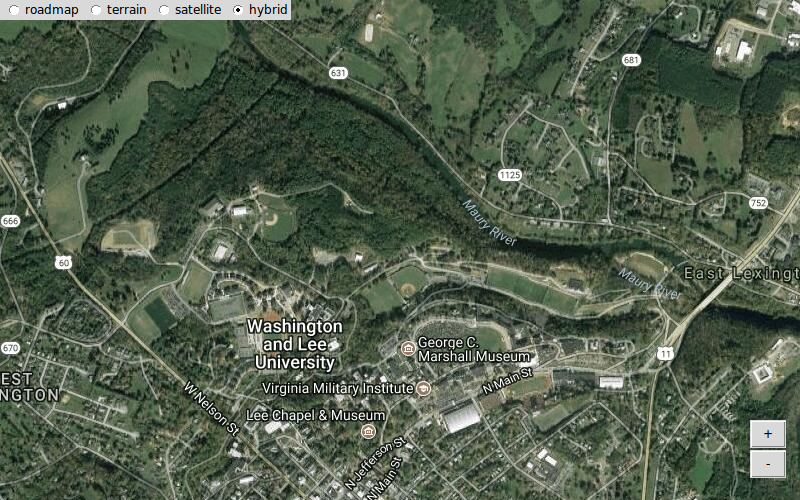

# GooMPy

Interactive Google Maps for Python.  Tested with Python2.7 and Python3.6.

GooMPy provides a Python interface to the Google Static Maps API, automatically
downloading and stitching together map tiles into a single image that you can
zoom and pan dynamically in your Python program.  To support using maps when
you don't have an internet connection, GooMPY provides a pre-fetching function
that stores the tiles in a caching folder.  To keep the amount of
tile-downloading to a minimum, GooMPy doesn't have functions for adding
waypoints or other annotations to the map through Google's API. 

To run GooMPy you'll need the Python Image Library (PIL) or equivalent (Pillow
for Windows and OS X) installed on your computer.  The repository includes an
example using Tkinter, though you should be able to use GooMPy with other
toolkits like wx and Qt.

Because Google limits the number of tiles that you can download during a given
time period, we recommend setting up an API key as described here:
  
  https://developers.google.com/maps/documentation/staticmaps/#api\_key
  
Once you have your key, put it in the file goompy/key.py, and GooMPy will use
it in fetching map tiles.  If you run out of downloads, the tiles will be black
with a "capacity exceeded" image in them.

